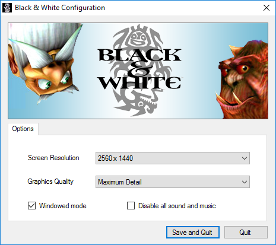

## Synopsis

Lionhead's Black & White 1 ships with a graphical options application outside of the game itself.
This application fails to write to the registry properly on newer operating systems and will sometimes
write invalid values. This simple C# application acts as a replacement for it.

[You can download the most recent version here.](https://github.com/HandsomeMatt/bw1-setup/releases)

## License

[The MIT License (MIT) - Copyright (c) 2017 Matt Stevens](LICENSE)
